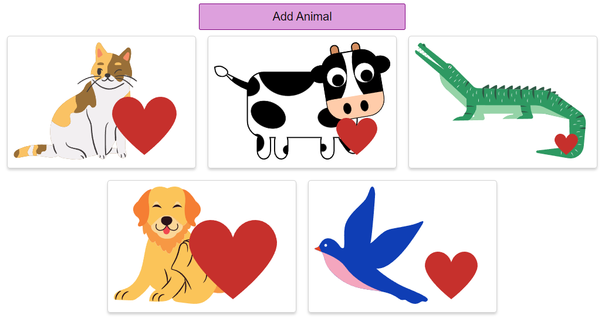

This was a react practice project to have a button that when clicked, will show random images of animals. Each image will have a small heart and once image is clicked, this heart will grow in size.

This was made in order to practice the following:
- Using events, such as a click event on the button. Creating an event handler to show each individual animal image.
- Make use of states, by including useState to change data in the app once a user interacts with it. This was used to add a random animal to the page every time the button was clicked. It was also used in order to increase the size of the heart when image was clicked.
- Building lists, by using map to pass each animal in the array to the AnimalShow component which will show a list of relevant data, i.e the list of animals.
